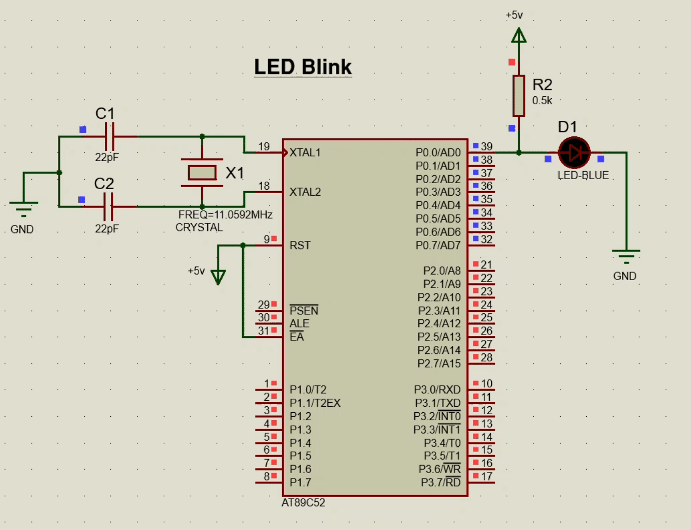

# LED Blink Circuit using 8051 micro-controller


<div align ="justify">

LEDs are small, powerful lights found in many applications. 
Blinking an LED is the "Hello World" of microcontrollers. 
It's as simple as turning a light switch on and off. 
Establishing this fundamental skill will provide a solid foundation for more complex experiments.

</div>

## Components Required:

- 1 x 89C52
- 1 x Led (any color)
- 1 x Resistor 
  
<br>


## ***Code***

<div align ="center">

<div align ="left">

<p height="400" width = "400"

```c

#include <reg52.h> 

void delay(int time){ 
	int i,j;
	for(i=0;i<time;i++)
			for(j=0;j<1275;j++);
}

sbit led =  P0^0; 

void main()	{
	P0 = 1;
	while(1)	{
		led = 1;
		delay(100);
		led = 0;
		delay(100);
	}
}


```
</p height="400" width = "400">

</div>

<div align ="right">


</div>

</div>

## OUPUT



<hr>

