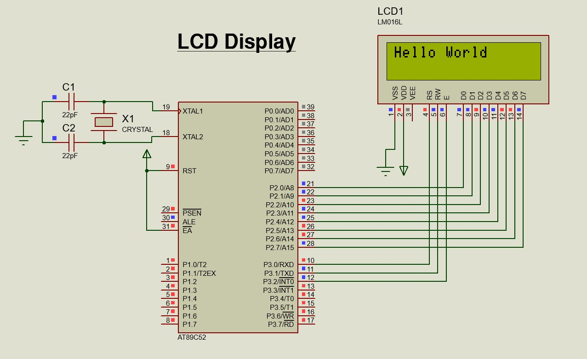

# Interfacing a LCD Display with 8051 micro-controller

<div align = "justify">

LCDs are useful for visual indicators,they can be used to display text along with 
data from sensors or anything you want to display.
Here you will learn how we can interface a lcd dsiplay with 89s52 and write a code for the same.

</div>

----

**Components Required :**

- 1 x 89C52
- 1 x LCD dsiplay 16x2 
  
----

## **Code**

```c
#include <reg52.h>

#define lcd_port P2 

sbit rs = P3^0;   
sbit rw = P3^1;   
sbit en = P3^2;   

void lcd_init();
void lcd_cmd(unsigned char command);
void lcd_data(unsigned char disp_data);
void lcd_print(unsigned char *text);
void delay(unsigned int time);

void lcd_init() {
		lcd_cmd(0x01);    lcd_cmd(0x38);    lcd_cmd(0x0c);    lcd_cmd(0x06);    lcd_cmd(0x80);     
}

void lcd_cmd(unsigned char command) { 
    lcd_port=command;
    rs = 0; rw = 0; en = 1;
    delay(1);
    en = 0;
}

void lcd_data(unsigned char disp_data) { 
    lcd_port=disp_data;
    rs = 1; rw = 0; en = 1;
    delay(1);
    en = 0;
}

void lcd_print(unsigned char *text) { 
    while(*text) {
        lcd_data(*text++);
    }
}

void delay(unsigned int time) { 
    unsigned int i,j;
		for(j = 0;j < time;j++)
			for(i = 0;i <= 1275;i++);
}

void main() {
    lcd_init();
		lcd_cmd(0x80);
		lcd_print("Hello World"); 

	while(1){
        // do anything here (ANYTHING)
	}
}
``` 

----

## **OUPUT**

<div align = "center">



</div>

-----