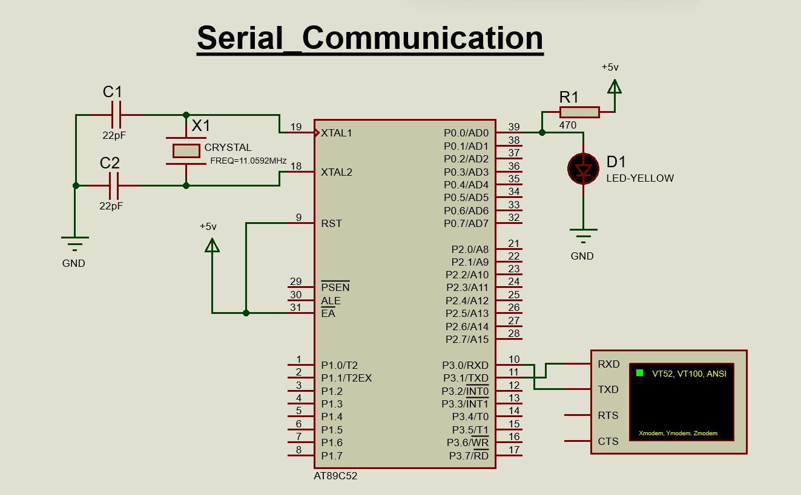
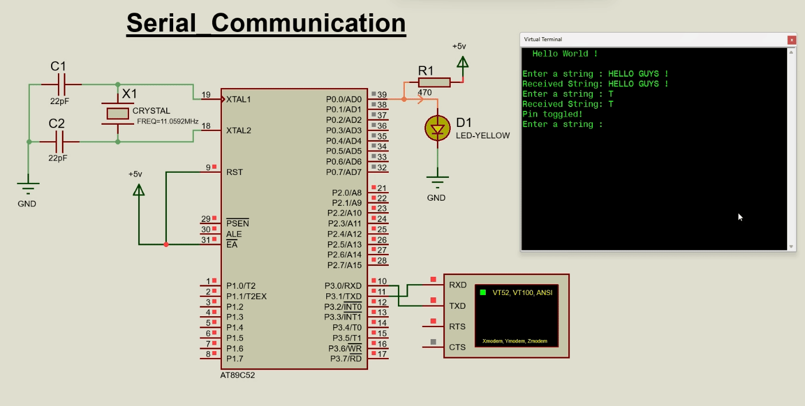

# Serial_Communication

<div align ="justify">

Serial communication is a method of sending and receiving data between devices one bit at a time, in a sequential order, over a single wire or channel. 
It's a key part of embedded systems, allowing devices to exchange information.
Serial communication is efficient for tasks like connecting devices or sending data over distances. 
It typically involves using fewer wires, which can help keep down on wiring material and relaying equipment costs.

**Types :**

There are two main types of serial communication: synchronous and asynchronous. 
- In synchronous communication, data is transmitted in sync with a clock signal. 
- In asynchronous communication, data is transmitted without a clock signal.

----

**Components Required:**

- 1 x 89C52
- 1 x Led (any color)
- Resistors as per circuit diagram
  
----

## **Diagram**

 

## **Code**

```c
#include <reg52.h>

char rxData[15] = {""};  // Buffer to hold received data

sbit TOGGLE_PIN = P0^0;  // Define the pin we will toggle (P1.0)

// Function to create a delay
void delay(int time) {
	int i,j;
    for (i = 0; i < time; i++)          // Outer loop for the specified delay time
        for (j = 0; j < 1275; j++);     // Inner loop to create the time delay
}

// Function to set up serial communication
void Serial_Begin() { 
    TMOD = 0x20;     // Configure Timer1 in Mode2 (8-bit auto-reload mode)
    TH1 = 0xFD;      // Load the timer value for 9600 baud rate
    SCON = 0x50;     // Set up serial mode: asynchronous, 8-bit data, 1 stop bit
    TR1 = 1;         // Start Timer1 to enable baud rate generation
    TI = 1;          // Set the transmit interrupt flag to indicate that we're ready to send data
}

// Function to send a single character via serial
void Serial_Tx(char tx_data) {
    while (!TI);              // Wait until the previous data has been transmitted
    TI = 0;                   // Clear the transmit interrupt flag for the next character
    SBUF = tx_data;           // Load the character we want to send into the buffer
}

// Function to send a string of characters via serial
void Serial_Print(char *text) {
    int i = 0;                   // Start at the beginning of the string
    while (text[i] != 0) {       // Loop until we hit the null-terminator
        Serial_Tx(text[i]);      // Send each character one at a time
        i++;                     // Move to the next character
    }
}

// Function to read a single character from serial input
char Serial_Read() {
    while (RI == 0);        // Wait until a character is received
    RI = 0;                 // Clear the receive interrupt flag for the next character
    return(SBUF);           // Return the received character from the buffer
}

// Function to read characters until a specific termination character is received
void Serial_ReadStringUntil(char *buffer, char terminator, int maxLength) {
    int index = 0;            // Initialize the index for our buffer
    char temp;              // Temporary variable to hold the received character

    while (index < maxLength - 1) {  // Keep reading until the buffer is full (leave space for null-terminator)
        temp = Serial_Read();        // Read one character from the serial input

        if (temp == terminator) {    // Check if we received the termination character
            break;                   // Stop reading if we hit the termination character
        } else {
            buffer[index++] = temp;    // Store the character in the buffer and increment the index
        }
    }
    buffer[index] = '\0';              // Null-terminate the string to make it a proper C string
}

// Function to toggle an I/O pin
void Toggle_Pin() {
    TOGGLE_PIN = ~TOGGLE_PIN;  // Flip the state of the defined pin (HIGH to LOW or LOW to HIGH)
    Serial_Print("Pin toggled!\r\n"); // Send a message confirming that the pin was toggled
}

// Main function: entry point of the program
void main() {
    Serial_Begin();                    // Initialize serial communication
	
    Serial_Print("  Hello World !  \r\n"); // Send a welcome message
		Serial_Print("\r\n");
    TOGGLE_PIN = 0;                    // Start with the toggle pin set to LOW

    while (1) {                 
				// Infinite loop		
			
				// Example 1: 
			
				/************** Check if the first character of the received string is 'T' ************/
			
        if (rxData[0] == 'T') {     // If the user entered 'T', toggle the pin
            Toggle_Pin();           // Call the function to toggle the pin
        }
				
        /************* ----------------------------------------------------------- ************/
				
			
				// Example 2: 
        
				/**************  Get String and Print on Serial monitor   *****************************/
			
        Serial_Print("\nEnter a string : ");    // Prompt the user for input
        Serial_ReadStringUntil(rxData, '\r', sizeof(rxData));     // Read input until Enter is pressed
        
        Serial_Print("\nReceived String: ");          // Print a message to indicate what was received
        Serial_Print(rxData);                           // Print the actual received string
        
				/************* ----------------------------------------------------------- ************/
				
        Serial_Print("\r");       // Print a new line for better formatting
        delay(100);                 // Introduce a small delay before the next iteration
    } 
}
``` 
## **OUTPUT**

<div align = "center">

[](./Files/Serial_Communication.mp4)

----
</div>
</div>