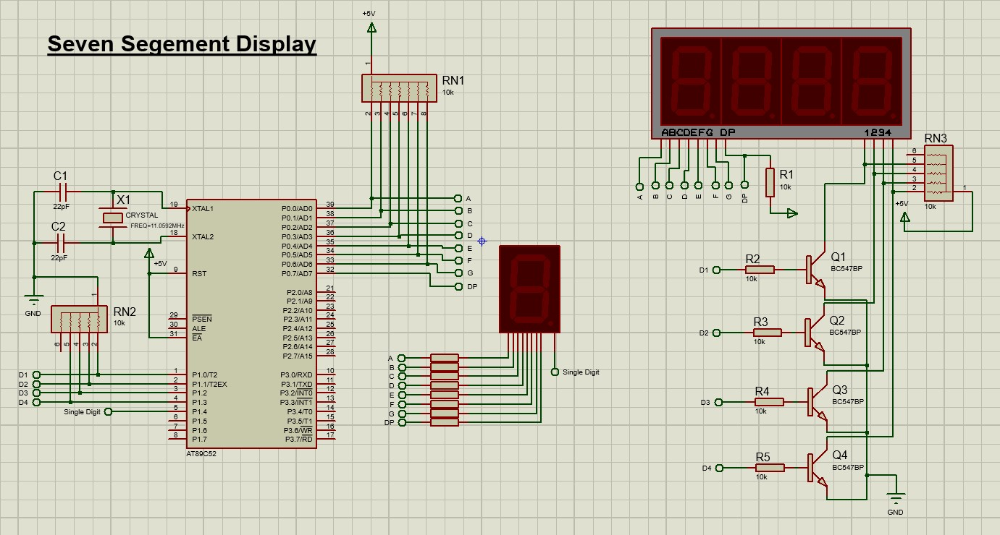
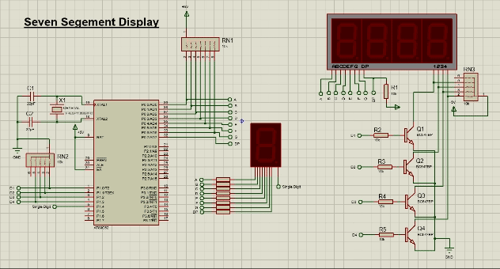

# Interfacing Seven Segment Displays

<div align ="justify">

Display can be useful to show numerical values in project or just for animations. Here we can see how segemnt displays which are leds just positioned as a digit so we can make number out them. There many types of segment displays out there. We have used one 1 digit display and one 4 digit display. See how they work and understand the code and maybe use them in you projects.

----

**Components Required:**

- 1 x 89C52
- 1 x Seven Segment Display (1 digit / 4 digit)
- Resistors as per circuit diagram
  
----

## **Diagram**

 

## **Code**

```c
#include <reg52.h>

#define led P0

sbit single_digit = P1^4; // for using only digit display

sbit D1 = P1^0;  // Control for 1st digit
sbit D2 = P1^1;  // Control for 2nd digit
sbit D3 = P1^2;  // Control for 3rd digit
sbit D4 = P1^3;  // Control for 4th digit

int i,refresh_rate = 1;

// Segment patterns for common cathode 7-segment display (abcdefg format)
char number[] = {
    0x3F,  // 0 -> abcdef (common cathode: segments to turn on for 1)
    0x06,  // 1 -> bc
    0x5B,  // 2 -> abdeg
    0x4F,  // 3 -> abcdg
    0x66,  // 4 -> bcfg
    0x6D,  // 5 -> acdfg
    0x7D,  // 6 -> acdefg
    0x07,  // 7 -> abc
    0x7F,  // 8 -> abcdefg
    0x6F   // 9 -> abcdfg
};

char segments[] = {1,2,4,8,16,32,64,128}; //abcdefgDP

void delay(unsigned int ms) { // Approximate 1 ms delay
    unsigned int i, j;
    for (i = 0; i < ms; i++)
      for (j = 0; j < 1275; j++);  
}

void test_numbers(){ //test numbers from 0-9
	for(i = 0;i <= 9;i++){
		led = number[i];
		D1 = D2 = D3 = D4 = 1;
		delay(25);
	}
		D1 = D2 = D3 = D4 = 0;
	
}

void test_segments(){ // test each segments from a-g and DP
	for(i = 0;i < 9;i++){
		led = segments[i];
		D1 = D2 = D3 = D4 = 1;
		delay(40);
	}
		D1 = D2 = D3 = D4 = 0;
}

void display(int n){ // Function for 4 digit displays
	
	single_digit = 1;
	
	led = number[n/1000];
	D1 = 1;
	delay(refresh_rate);
	D1 = 0;
	
	led = number[(n/100) % 10];
	D2 = 1;
	delay(refresh_rate);
	D2 = 0;
	
	led = number[(n/10) % 10];
	D3 = 1;
	delay(refresh_rate);
	D3 = 0;
	
	led = number[n % 10];
	D4 = 1;
	delay(refresh_rate);
	D4 = 0;
}

void main() {
	// turn off everything
		led = 0;
		D1 = D2 = D3 = D4 = 0;
		single_digit = 1;
		delay(100);
	
	// test functions
		single_digit = 0;
	
		test_segments();
		delay(100);
	
		test_numbers();
		delay(100);
	
		
		display(1234);
	
	// loop
	while(1)
	{
		for(i=0;i<9999;i++){
			display(i);
		}		
	}
}
``` 
## **OUTPUT**

<div align = "center">



-----
</div>
</div>